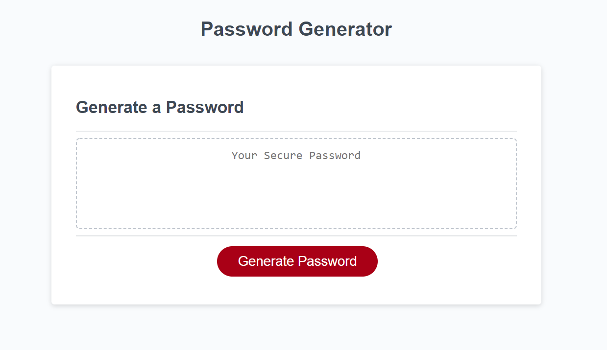

# password-generator
# OBJECTIVE:
* A password generator that can gives a password after prompted on number of characters and type of charaters.
# The following steps were taken to create this password generator:
* First listed the variables for the application and character sets that were to be used.
* Next entered the click function to start the application.
* Then the next step started the function code to ask how many characters was wanted between 8 and 128.
* This needed to be followed by verification step that a number was entered between 8 and 128.
* A prompt is needed if an incorrect value is enterd to let the user know that they needed to enter a correct number between 8 and 128.
* User would then be asked another series of questions for type of character that were wanted to be used such as Lowercase, Uppercase, Number, or Special charaters.
* A prompt is needed to inform user that if they had not selected one of the 4 characters to be used that they were required to select at least one to get a password. 
* Next a verification step is needed with a series of else if statements verifying that at least one of the questions was answered yes to create the password.
* Finally the function for randomly selecting the characters is needed to get the generated password for the application.

# Below is the GitHub Pages published link and the GitHub Repository address:

https://bilcon.github.io/password-generator/

https://github.com/bilcon/password-generator

# Here is a screen shot of the webpage when deployed

